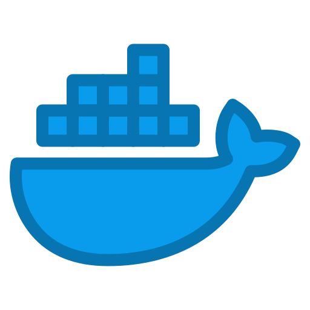

<p align="left">
  
</p>

# DockMon

DockMon is a simple and user-friendly desktop application for monitoring and managing Docker containers, built with Python Tkinter. Instantly view container status, resource usage, and perform operations such as start, stop, restart, rebuild, and view logs—all in one place. DockMon also supports Docker Compose detection and compatibility.

## Features

- **Live Monitoring:** Auto-refresh display of all Docker containers, including status and resource consumption.
- **Start/Stop/Restart Containers:** Easily control containers with single-click operations.
- **Rebuild and Relaunch:** Quickly rebuild and restart containers using Docker Compose.
- **View Logs:** One-click access to the latest 50 lines of container logs.
- **Uptime Display:** Accurate running time shown in days/hours/minutes/seconds.
- **Cross-platform:** Supports Windows, Linux, and MacOS. Automatically selects docker compose or docker-compose command.

## Technical Highlights

- Built with Python 3 and Tkinter GUI framework.
- Uses `docker` Python SDK to connect to local Docker service.
- Background threads for smooth UI and real-time updates.
- Single-file main program; easy to deploy and maintain.

## Installation & Usage

1. **Install dependencies** (requires Python 3, Docker, and Docker Compose):
   ```bash
   pip install docker
   ```

2. **Clone the repository**:
   ```bash
   git clone https://github.com/Shiroko253/DockMon.git
   cd DockMon
   ```

3. **Run DockMon**:
   ```bash
   python main.py
   ```


## License

This project is licensed under the MIT License.

---

For Traditional Chinese, please refer to [README-ch_tw.md](doc/README-ch_tw.md).

Feel free to submit issues or pull requests to help improve DockMon!
